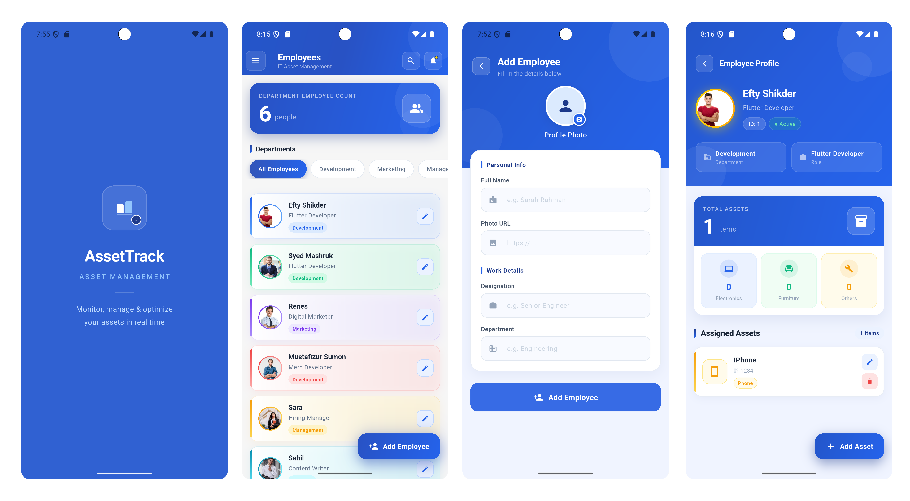

# 🏢 IT Asset Requisition System

> A comprehensive Flutter mobile application for HR departments to manage employees and track company assets in real-time.

---

<div align="center">
  
</div>

---

## 📋 Overview

IT Asset Requisition System is a production-ready, Firebase-powered mobile application that streamlines HR operations by providing complete employee lifecycle management and asset allocation tracking. Built for HR professionals who need real-time visibility into organizational resources and personnel.

---

## ✨ Features

### 👥 Employee Management
- **Create** new employees with auto-generated unique IDs
- **View** live employee lists with real-time streaming updates
- **Update** employee designations and department assignments
- **Delete** employees with automatic cleanup of all associated assets
- **Filter** by department with instant live count updates

### 📦 Asset Management
- **Assign** assets to employees with category selection
- **Track** asset details — name, serial number, category, timestamp
- **Edit** or remove assets from employee records
- **Validate** unique serial numbers to prevent duplicates
- **Categorize** across 7 types: Phone, Laptop, Desktop, Monitor, Keyboard, Mouse, Others

### 🏗️ Department Management
- Dynamic department lists auto-populated from employee data
- Real-time filtering and employee counting per department
- Instant sync when employees change departments

---

## 🛠️ Tech Stack

| Layer | Technology |
|---|---|
| Framework | Flutter |
| State Management | GetX |
| Backend / Database | Firebase Firestore |
| Authentication | Firestore-based (email + password) |
| Local Storage | SharedPreferences |
| Platforms | Android · iOS · Web |

---

## 🗂️ Project Structure

```
lib/
├── auth/
│   └── auth_controller.dart
├── controllers/
│   ├── employee_controller.dart
│   └── employee_details_controller.dart
├── custom_widgets/
│   ├── asset_dialog.dart
│   ├── asset_list_item.dart
│   ├── custom_app_bar.dart
│   ├── department_filter_widget.dart
│   ├── employee_count_widget.dart
│   ├── employee_info_card.dart
│   ├── employee_list_widget.dart
│   └── total_assets_card.dart
├── screens/
│   ├── add_employee_screen.dart
│   ├── edit_employee_screen.dart
│   ├── employee_asset_details.dart
│   ├── employee_details.dart
│   ├── homepage_screen.dart
│   └── login_screen.dart
└── utils/
    ├── constants.dart
    └── helper.dart
```

---

## 🗄️ Firestore Data Structure

### `employee` collection
```json
{
  "id": 1,
  "name": "Efty Shikder",
  "designation": "Flutter Developer",
  "department": "Development",
  "img": "https://..."
}
```

### `assets` collection
```json
{
  "name": "MacBook Pro 14",
  "sn": "MBP-2024-001",
  "category": "Laptop",
  "assinee_id": 1,
  "image_url": "https://...",
  "timestamp": "2024-01-15T10:30:00Z"
}
```

### `hr_login` collection
```json
{
  "email": "hr@company.com",
  "password": "••••••••"
}
```

---

## 🚀 Getting Started

### Prerequisites
- Flutter SDK `>=3.41.6`
- Dart SDK `>=3.0.0`
- Firebase project with Firestore enabled
- Android Studio / VS Code

### Installation

---

## ⚠️ Known Limitations

- Passwords are currently stored in **plain text** in Firestore — upgrade to **Firebase Authentication** before deploying to production
- Profile images are loaded via URL — consider integrating **Firebase Storage** for direct image uploads

---

## 📄 License

This project is licensed under the MIT License.

---